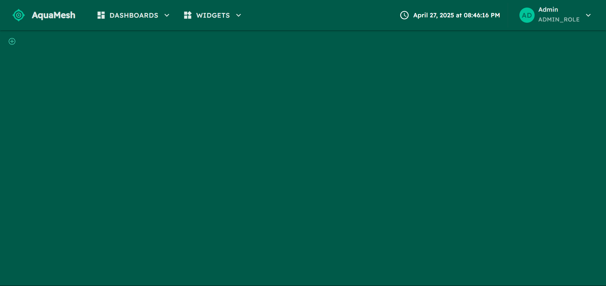
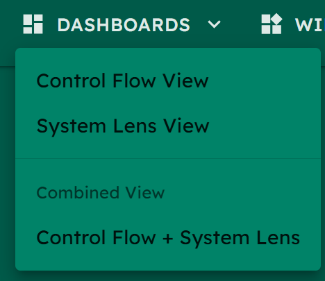
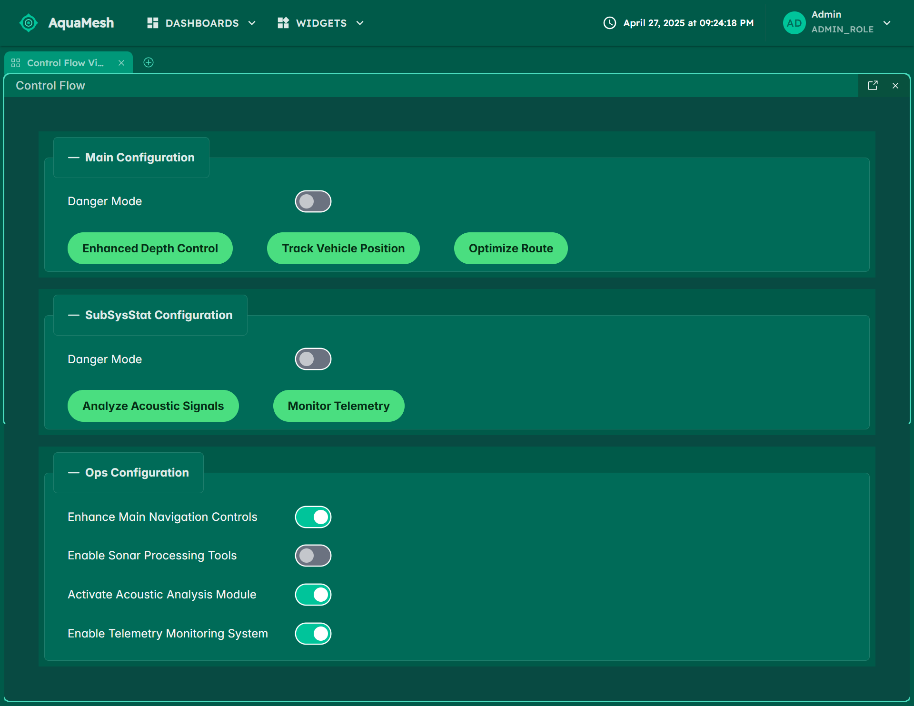
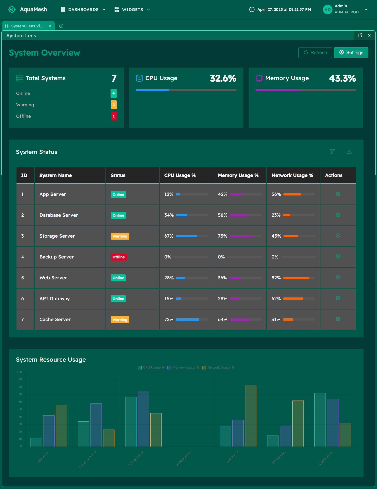
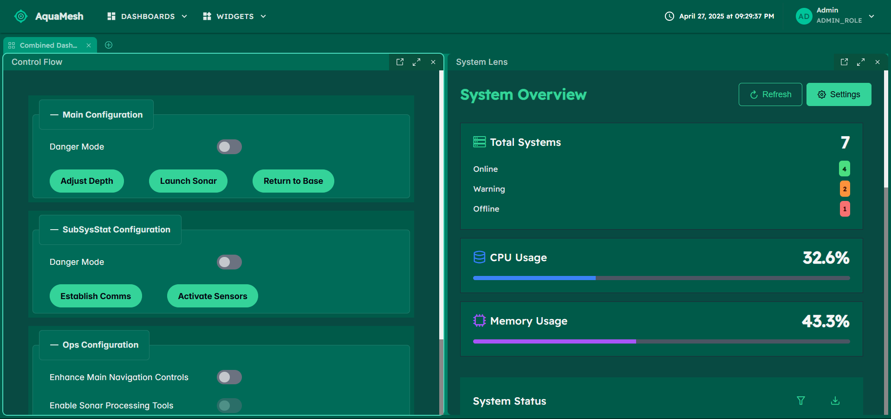

# 🌊 AquaMesh - Advanced Underwater Monitoring System
🌊 AquaMesh is an advanced underwater monitoring platform built to monitor and manage submarine operations and underwater systems. Built on a React-based Turborepo monorepo architecture, it dynamically loads microfrontends to provide real-time updates from various underwater systems. This highly flexible platform allows new components to be added easily through a dynamic federation setup.

## 🚀 Getting Started
To get started with AquaMesh, follow these simple steps:

1. Clone the repository.
2. Run the following command in the root directory:
```sh
npm install
```
3. Once dependencies are installed, launch the project with:
```sh
npm start
```
That's it! Everything else is already configured for you. The AquaMesh app and all its components will be up and running.

## ⚙️ Project Structure
**AquaMesh** is a React-based monorepo to manage its three key applications:

- **AquaMesh (Kernel)**: the core app acts as the kernel, dynamically loading microfrontends via module federation. 

- **System Lens (MFe)**: exposes information about the processes and status inside the underwater systems.

- **Control Flow (MFe)**: focuses on operational flow and control of underwater systems.


## 📷 Images
### Empty
Initial state of the AquaMesh platform before any microfrontends are loaded.



### Top Navigation
Provides navigation and access to different modules like System Lens and Control Flow. Users can add or remove widgets from here via changing `apps/aquamesh/public/config/widgets.json`.

**Topbar**


**Widgets**


**Dashboards**



### Control Flow (MFe)
It is designed for managing the operational flow and controlling underwater systems. It displays various controls and settings related to underwater operations.



### System Lens (MFe)
It provides a detailed view of internal underwater processes and statuses, allowing for real-time monitoring and analysis.



### System Lens and Control Flow
Different modules can be active simultaneously in this customizable workspace.



### Drag and Resize capabilities
This image illustrates the platform's drag-and-resize feature, enabling users to move, resize, and organize different widgets to customize their workspace layout according to their needs.


## 🏗️ Architecture Overview
The following sections explore AquaMesh's design and functionality for those wanting to dive deeper into the platform's architecture and modularity.

### 📦 Modular Design with Dynamic Microfrontends
AquaMesh's dynamic module federation simplifies system updates and expansion:

- **Dynamic Microfrontend Loading**: New microfrontends can be added by editing the configuration file, allowing seamless integration of external apps without code changes.

- **Drag and Drop**: widgets like Control Flow or System Lens can be freely moved, resized, and positioned for a customizable workspace.

- **Resizing**: Users can adjust widget sizes to focus on specific data, enhancing control over underwater operations.

### 🛠 Turborepo Setup
The AquaMesh platform uses **Turborepo** for managing the three applications in the monorepo:

- **Simplifies package management**: Only one npm install is needed from the root.
- **Speeds up development**: Built-in tools for running and building multiple projects simultaneously.
- **Consistency**: Shared dependencies and workspace scripts ensure all microfrontends work seamlessly together.

### 🌱 Future-Proof and Scalable
The flexibility of dynamically adding microfrontends ensures AquaMesh is future-proof. This approach allows for:

- **Scalability**: New microfrontends can be added without modifying the core codebase.
- **Ease of Maintenance**: Updates to individual microfrontends do not affect the overall platform stability.
- **Rapid Deployment**: Teams can focus on developing new features while AquaMesh automatically integrates them.

🔍 Dive in and explore the system! 🌊