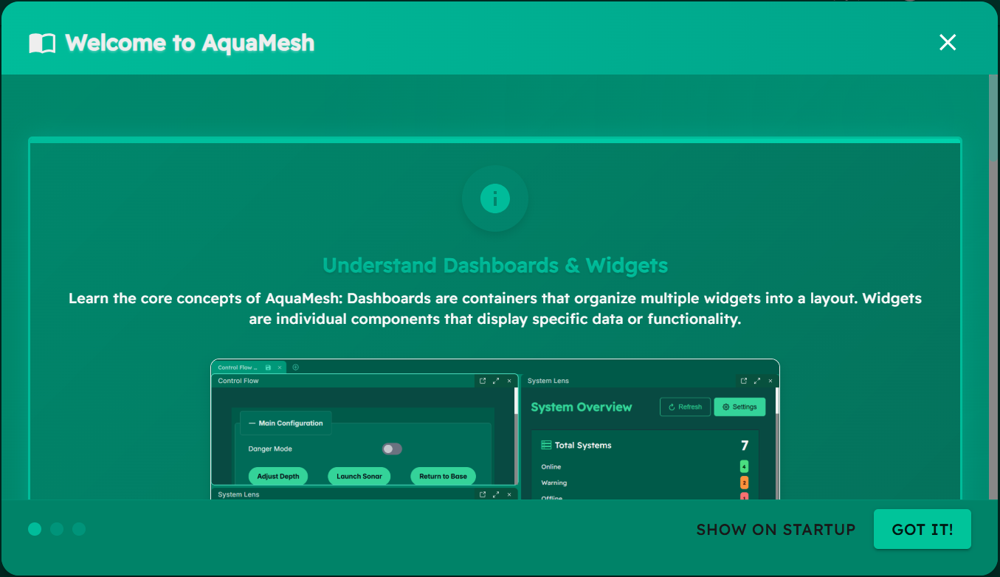
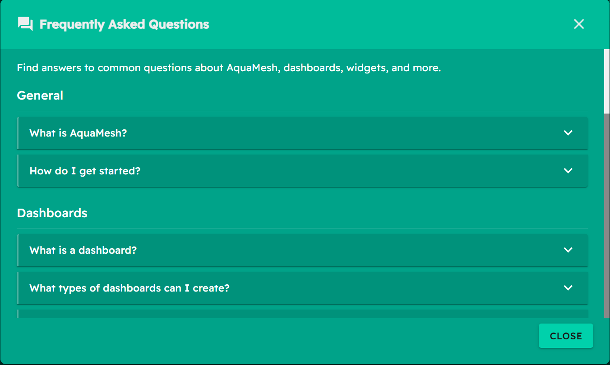
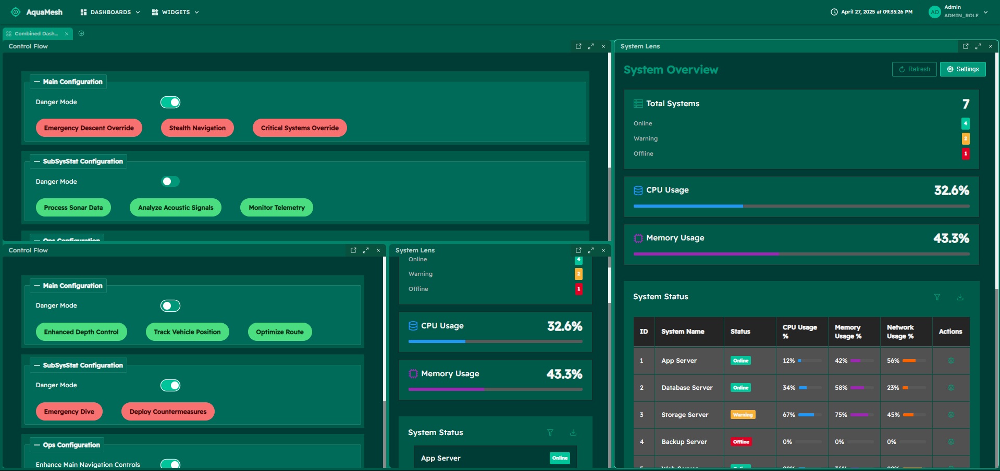
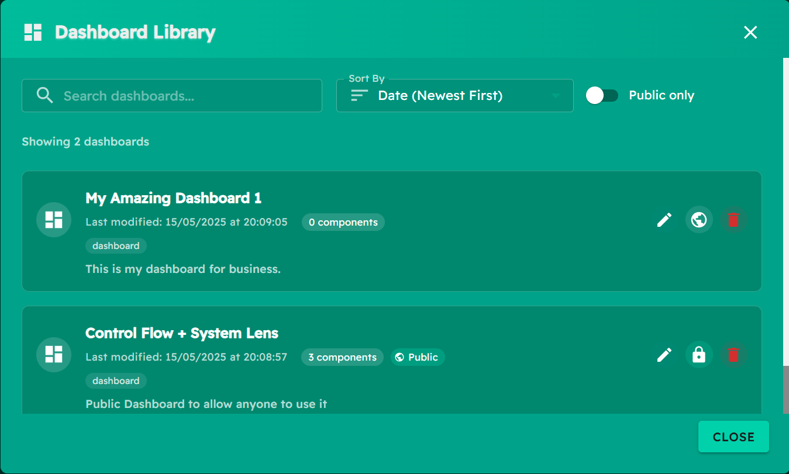
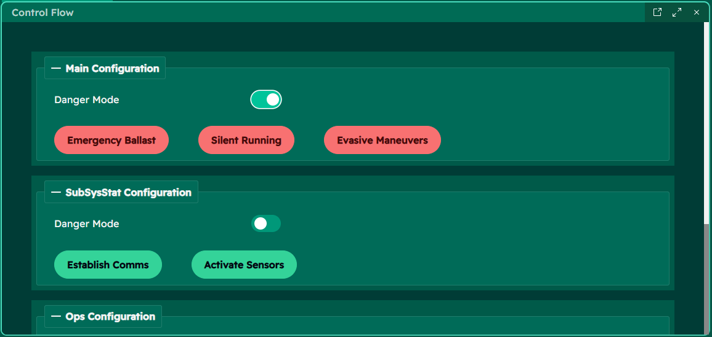
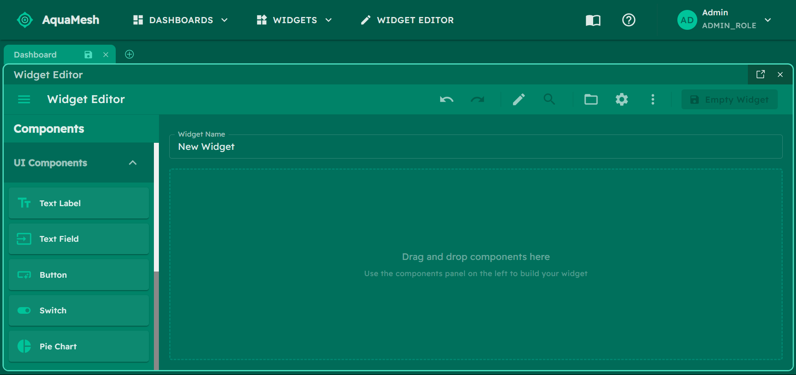
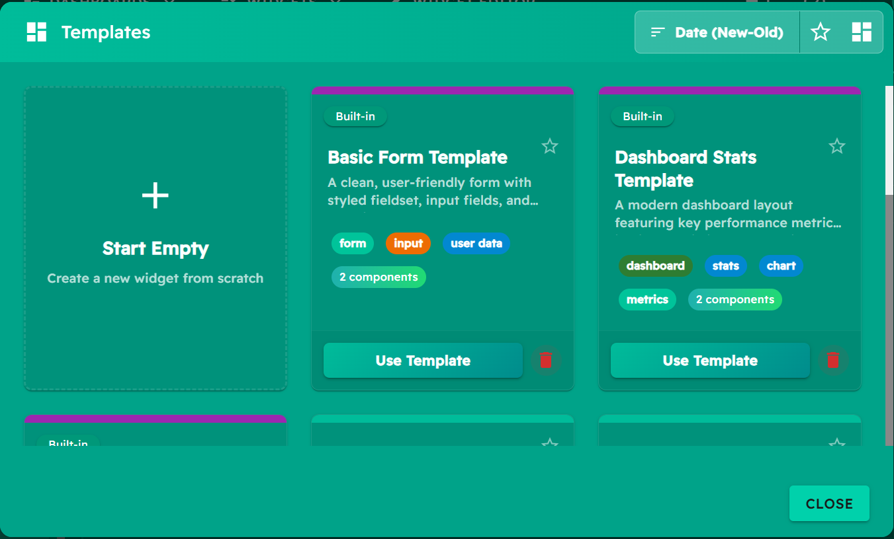
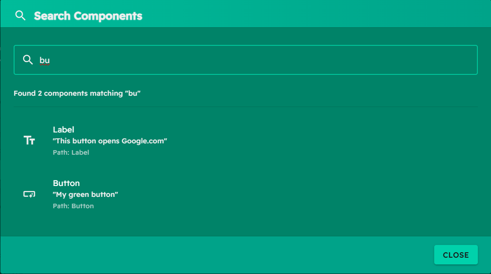
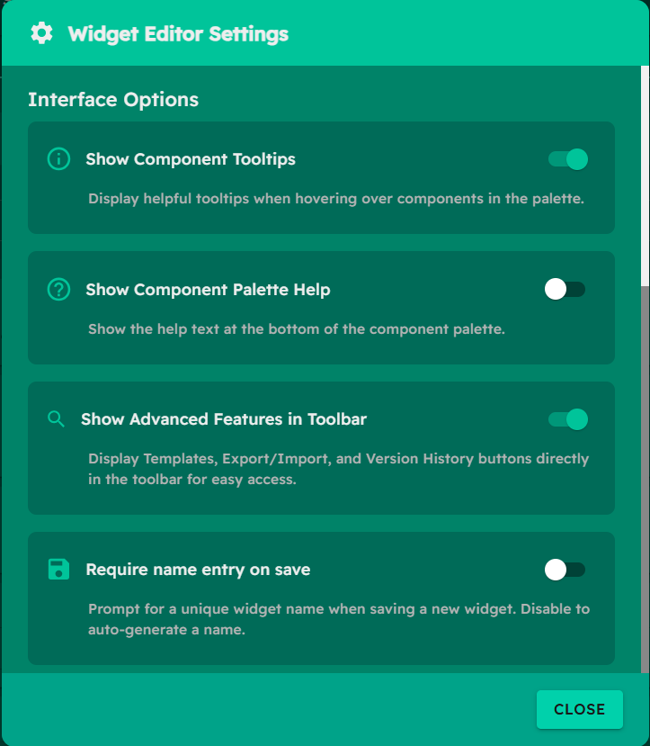

# 🌊 AquaMesh | No-Code Dashboard Platform with React & Module Federation

🌊 AquaMesh is a powerful no-code dashboard creation platform that enables users to build, customize, and manage interactive dashboards through an intuitive drag-and-drop interface.

Built on a React-based Turborepo monorepo architecture, it dynamically loads components and allows for highly flexible customization of dashboards and widgets.

## ✨ Key Features
- **🔧 No-Code Widget Editor:** Build custom widgets without programming knowledge
- **📊 Dynamic Dashboard System:** Drag, resize, and position widgets in flexible layouts
- **🔗 Module Federation Architecture:** Load widgets as independent micro-frontends
- **⚡ React-based Turborepo Structure:** Optimized monorepo for efficient development
- **🎨 Rich Component Library:** Pre-built UI elements, containers, and visualization tools

## 🚀 Quickstart

```sh
# Clone the repository
git clone https://github.com/CosmeValera/AquaMesh.git

# Install dependencies (just one command for the entire monorepo!)
npm install

# Launch AquaMesh
npm start
```

That's it! The AquaMesh application and all its components will be up and running.

## 🔍 Tutorial
When you first use the app, a **Tutorial** will automatically appear, explaining **Dashboards**, **Widgets**, and the **Widget Editor** features. You can revisit this tutorial anytime from the help menu. For specific questions, there's also a **FAQ** section available.





### 📊 Dashboards

Dashboards are container layouts that organize multiple widgets into a cohesive view. Think of them as the canvas where you arrange your widgets (visual components).



In the **Dashboard Library**, you can save, categorize, and change visibility of your dashboards.



### 🧩 Widgets

Widgets are individual components that display specific data, visualizations, or controls. Each widget serves a distinct purpose and can be added to any dashboard.



In the **Widget Library**, you can sort, load and delete your widgets.


### 🔧 Widget Editor

AquaMesh's most powerful feature is its **Widget Editor**, which enables users to create custom widgets without coding:

**Widget Editor Features:**

- **Intuitive Drag & Drop**: Easily drag components from the palette onto your canvas to design widgets.
- **Component Library**: Choose from UI components (buttons, switches, text fields), layout containers, and data visualization tools.
- **Customization**: Adjust appearance and behavior through property editors.
- **Live Preview**: See your changes instantly.



**Widget Editor Advanced Features:**
- **Templates**: Templates are predefined widget configurations that you can use to quickly create new widgets.



- **Import & Export**: You can export your widgets as JSON to import them later. This is useful for backup or sharing with others.


- **Versions**: A version control system is already built-in. You can see all your saved versions of the current widget, and you can restore any previous version.


- **Search**: Quickly search for any component in your canvas.



- **Settings**: Settings for: Interface options, Confirmation options and Keyboard Shortcuts.



### 🧭 Top Navigation

The top navigation bar provides quick access to all platform capabilities:

- **📊 Dashboards**: Browse and select from both predefined and custom dashboards
- **🧩 Widgets**: Access ready-made components and your custom-built widgets
- **🔧 Widget Editor**: The heart of our no-code experience. Build custom widgets without programming!
- **📚 Libraries**: Save and organize your dashboard and widget creations
- **❓ Support**: Get help through the tutorial and FAQ sections
- **👤 User Management**: Select and manage user profiles (only admin can create new widgets)

All our pre-built widgets load as microfrontends using Module Federation. Want to customize what's available? Just update the `apps/aquamesh/public/config/widgets.json` file. 

## 🏗️ Architecture Overview

### 💻 Technology Stack
AquaMesh uses modern frontend technologies to deliver a powerful and intuitive experience:

- **React:** The core framework for the interface
- **flexlayout-react:** Powers the dashboard's flexible layout system, allowing widgets to be resized and repositioned
- **react-tabs:** Manages multiple dashboard views, each with their own set of widgets
- **🧪 Testing Suite:**
  - **Playwright:** End-to-end testing that validates the full application workflow
  - **Vitest:** Fast and efficient unit testing for individual components
  - **bashunit:** Modern bash testing library for testing bash scripts 

### 📦 Modular Design with Dynamic Component Loading

AquaMesh's architecture emphasizes flexibility and extensibility:

- **Drag and Drop Interface**: Widgets can be freely moved, resized, and positioned.
- **Dynamic Component Loading**: New predefined widgets can be added easily through configuration.
- **Customizable Dashboard**: Users have complete control over their layout.

### 🛠 Turborepo Setup

The platform uses **Turborepo** for managing the applications in the monorepo:

- **Simplified package management**: Only one npm install needed from the root.
- **Efficient development**: Built-in tools for running and building multiple projects simultaneously.
- **Consistency**: Shared dependencies and dashboard scripts ensure all components work seamlessly together.

🔍 Start creating amazing dashboards today! 🌊