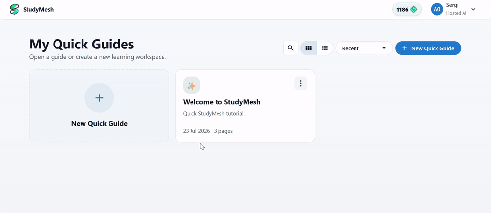
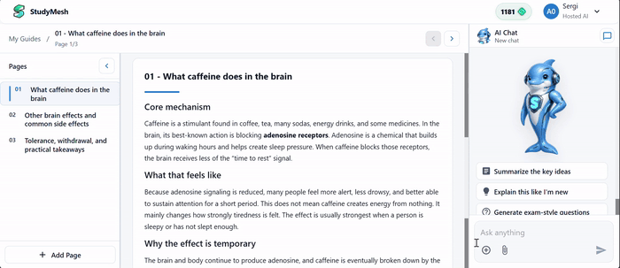

# StudyMesh

> **Quick guides that adapt to you.**

StudyMesh turns a one-line prompt into a full, multi-page **Quick Guide** that explains new ideas
by connecting them to what you already understand. Say what you're curious about (a hobby, a
skill, a subject you're studying) and get clear lessons, quizzes, and exercises.

**[Try StudyMesh →](https://studymesh.cosmevalera.dev/)**

<!-- HERO GIF: the flagship flow in one clip — type a prompt → a Quick Guide generates → study it in the workspace -->


## What you can do

- **Create a Quick Guide:** write a prompt, get a full multi-page guide with lessons and exercises.
- **Adapts to what you know:** select the fields you already understand and new Quick Guides will be re-explained through your current knowledge.
- **Grows on demand:** guides start at ~3 pages; ask AI Chat for more depth, examples, or practice and it adds pages.
- **Turn a guide into study material:** one click makes a quiz, a set of flashcards, or a short podcast recap.
- **AI Chat:** ask questions about a guide; it can pull in web sources when the material doesn't cover something.
- **Workspace:** arrange guides and widgets on a drag-and-resize dashboard canvas.

## See it in action

<!-- Small thumbnails, one row. Keep each ~200px wide so this stays compact. Podcast is a static image (audio). -->
| Quiz | Flashcards | Podcast | AI Chat |
|:---:|:---:|:---:|:---:|
|  |  |  |  |

## Bring your own AI

Choose how guides are generated in **Settings › AI Mode**: **Hosted AI** (uses Study Credits),
your **own API key**, or **Google's on-device Local AI** (free, runs in the browser).

## Run it locally

```sh
git clone https://github.com/CosmeValera/StudyMesh.git
cd StudyMesh
npm install
npm start
```

`npm start` runs the app with its serverless API routes; open http://localhost:3000.

## Built with

- React + TypeScript 
- Turborepo monorepo 
- `flexlayout-react` dashboard canvas 
- PrimeReact
- Vitest + Playwright.
