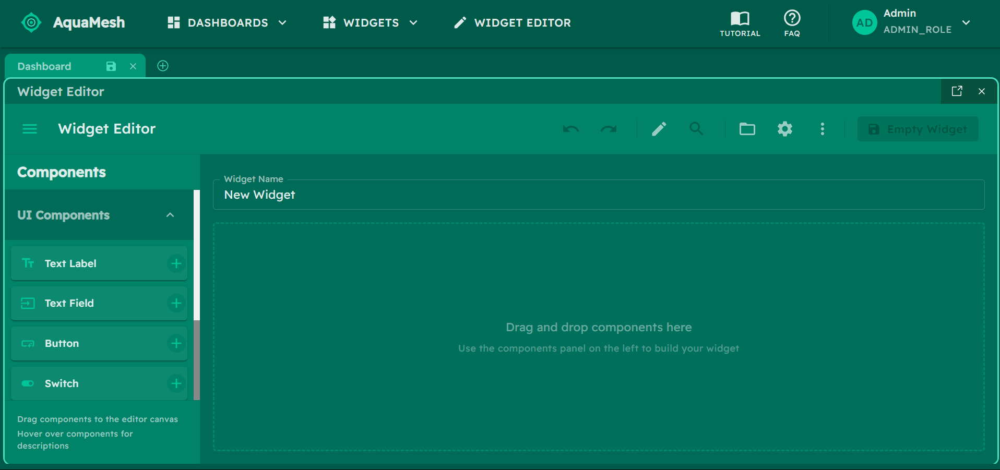
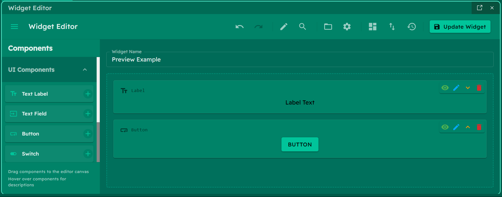

## 🔍 Tutorial
When you first use the app, a **Tutorial** will automatically appear, explaining **Dashboards**, **Widgets**, and the **Widget Editor** features. You can revisit this tutorial anytime from the help menu. For specific questions, there's also a **FAQ** section available.

**Tutorial:**

**FAQ:**

### 🧭 Top Navigation

The top navigation bar provides quick access to all platform capabilities:

- **📊 Dashboards**: Browse and select from both predefined and custom dashboards
- **🧩 Widgets**: Access ready-made components and your custom-built widgets
- **🔧 Widget Editor**: The heart of our no-code experience. Build custom widgets without programming!
- **📚 Libraries**: Save and organize your dashboard and widget creations
- **❓ Help**: Get support through the tutorial and FAQ sections
- **👤 User**: Select and manage user profiles (only admin can create new widgets)

All our pre-built widgets load as microfrontends using Module Federation. Want to customize what's available? Just update the `apps/aquamesh/public/config/widgets.json` file.

### 📊 Dashboards

Dashboards are container layouts that organize multiple widgets into a cohesive view. Think of them as the canvas where you arrange your widgets (visual components).

In the **Dashboard Library**, you can save, categorize, and change visibility of your dashboards.

### 🧩 Widgets

Widgets are individual components that display specific data, visualizations, or controls. Each widget serves a distinct purpose and can be added to any dashboard.

In the **Widget Library**, you can sort, load and delete your widgets.

### 🔧 Widget Editor

AquaMesh's most powerful feature is its **Widget Editor**, which enables users to create custom widgets without coding:

**Widget Editor Features:**

- **Intuitive Drag & Drop**: Easily drag components from the palette onto your canvas to design widgets.
- **Component Library**: Choose from UI components (buttons, switches, text fields), layout containers, and data visualization ..
- **Customization**: Adjust appearance and behavior through property editors.
- **Live Preview**: See your changes instantly.

**Widget Editor Common Features:**

- **Toggle Edit/Preview modes**: Add, adjust and move your components in the Edit mode. Use the Preview mode to see how it would look like.

**Edit mode:**

**Preview Mode:**

- **Search**: Quickly search for any component in your canvas.

- **Settings**: Settings for-> Interface options, Confirmation options and Keyboard Shortcuts.

**Widget Editor Advanced Features:**
- **Templates**: Templates are predefined widget configurations that you can use to quickly create new widgets.

- **Versions**: A version control system is already built-in. You can see all your saved versions of the current widget, and you can restore any previous version.

- **Import & Export**: You can export your widgets as JSON to import them later. This is useful for backup or sharing with others.

### 📱💻🖥️ Responsive
Aquamesh is responsive and can be used with your phone, tablet or computer. However, computer is the most recommended especially to build complex layouts.

#### 📱 Phone

